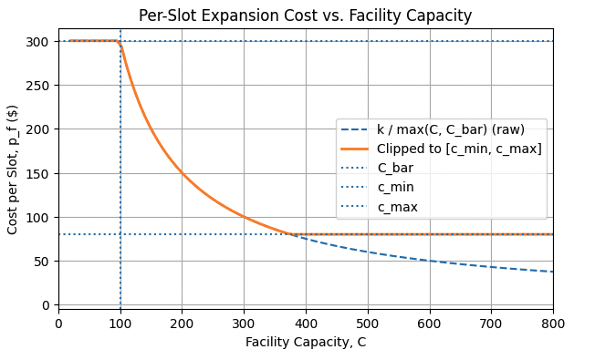
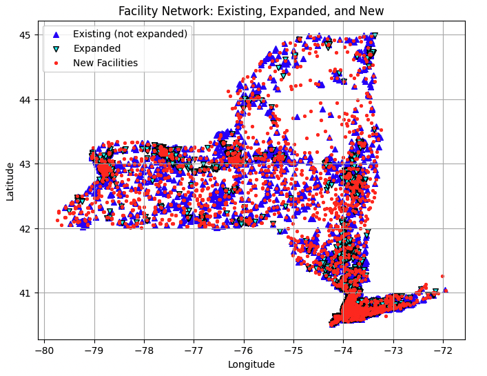
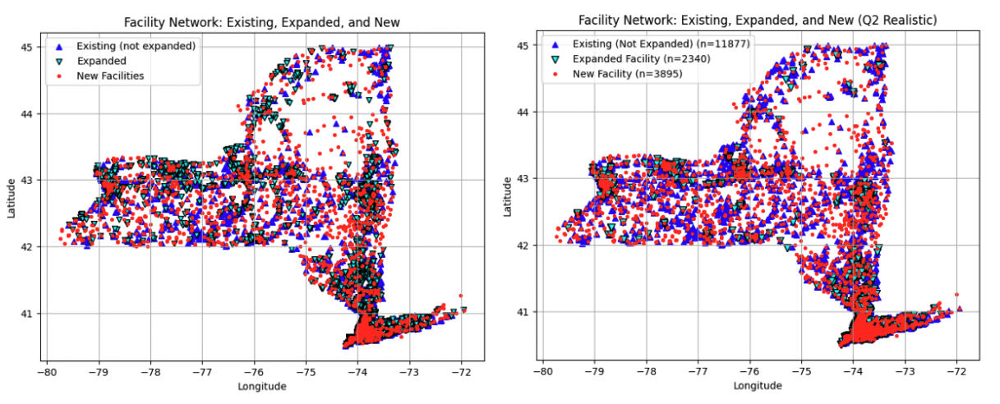

# IEOR 4004 Project 1: Eliminating Childcare Deserts in New York State
**Fall 2025, Columbia University**

**Authors:** Yifan Chen, Henry Wang, Sabrina Wang, Zihan Zuo  
**Instructor:** Dr. Yaren Bilge Kaya  

---

## 1 Introduction

### 1.1 Background

Child care, defined as the supervision and care of children, is a cornerstone of a functional economy. It is a vital service for working parents, offering a professional and safe environment for children while their parents are at work. It is directly linked to robust labor force participation, economic stability, and the well-being of children. Despite its importance, the United States faces a persistent and widespread challenge known as "child care deserts". According to the report from CPA (Malik et al., 2018), this is not a localized issue; over half of all Americans live in areas classified as child care deserts. 

This project focuses specifically on the issue as it manifests in New York State (NYS), where many regions are designated as child care deserts. The crisis in New York is well-documented in the report by Kyriakou and O'Connor (2024), which states that, as of 2021, the state's child care system was on the verge of collapse. Even by late 2024, it was confirmed that more than half of the state remained a child care desert, with immense barriers to access persisting for families.

---

### 1.2 Problem formulation

The goal of this project is to estimate the minimum total budget required for New York State (NYS) to eliminate child-care deserts across all ZIP codes using a mixed-integer optimization model in Gurobi. 
To address this, NYS can either build new facilities of standardized sizes or expand existing ones . To move from a general problem to a solvable model, this project uses the specific quantitative definitions adopted by NYS to classify these deserts. This classification depends on factors including the number of available slots, the population of children requiring care, the percentage of employed parents, and the area's average income .
The model therefore determines the optimal mix of new construction and expansion decisions that satisfies demand at the lowest total cost. This must be done while adhering to all policy constraints, including the special capacity requirements for children aged 0-5 .

---

### 1.3 Data Source and Assumptions

The model integrates five datasets: avg_individual_income.csv, child_care_regulated.csv, employment_rate.csv, population.csv, and potential_locations.csv. These datasets provide the ZIP code–level information necessary for defining population demand, existing facility capacity, and socioeconomic indicators.
To ensure consistency, several preprocessing steps were taken:
- All datasets were merged on ZIP codes.
- Facility-level data were aggregated by ZIP code to align with demographic information.
- Missing numeric values (e.g., income, employment rate) were replaced with the mean value of the corresponding column.
- Capacity data for ages 0-5 and 5-12 were derived by summing relevant columns (infant, toddler, preschool, and school-age capacity), with missing entries filled as zero. We also made one key assumption: the 5–12 age group was approximated by including three-fifths of the 10–14 age group to capture the overlapping school-age range.

These preprocessing steps ensure a complete and consistent dataset for ZIP-level optimization while minimizing bias introduced by data gaps.

---

## 2 The Idealistic Model

### 2.1 Defining Sets and Parameters

Set of zipcodes  
Set of existing facilities in zip code  
Set of potential facility locations in zip code  

| Symbol | Description | Value  |
| :------ | :----------- | :------------- |
| $C_f$ | Total capacity of existing facility $f \in F$ | - |
| $C_f^{0-5}$ | Current capacity for ages 0–5 at facility $f \in F$ | - |
| $\text{size}_s$ | Total slots for a new facility of type $s \in S$ | $\{100, 200, 400\}$ |
| $\text{cost}_s$ | Fixed cost to build a facility of size $s \in S$ | $\{65{,}000, 95{,}000, 115{,}000\}$ |
| $N_z^{0-5}$ | Population aged 0–5 in ZIP code $z \in Z$ | - |
| $N_z^{5-12}$ | Population aged 5–12 in ZIP code $z \in Z$ | - |
| $N_z = N_z^{0-5} + N_z^{5-12}$ | Total children under 13 | — |
| $E_z$ | Employment rate in ZIP code $z \in Z$ | - |
| $I_z$ | Average household income in ZIP code $z \in Z$ | - |
| $\theta_z$ | Required coverage rate (high demand = 0.5; otherwise 1/3) | $ \theta_z = \begin{cases} 0.5, & \text{if } E_z \ge 0.6 \text{ or } I_z \le 60{,}000 \\[6pt] \frac{1}{3}, & \text{otherwise} \end{cases} $ |
| $k$ | Economy-of-scale constant in per-slot cost.  | $30,000$ |
| $c_{\min}, c_{\max}$ | Minimum and maximum per-slot costs | $\{80, 300\}$ |
| $\bar{C}$ | Lower bound for capacity in cost formula | $100$ |
| $\text{limit}_f$ | Expansion cap | $\min(1.2 \cdot C_f, 500)$ |
| $\alpha$ | Equipment cost per new 0–5 slot | $ \$100$ per slot |
| $\beta_f$ | Fixed cost for major ($\geq 100%$) expansions | $\$20,000 + 200·C_f$ |

**Table 1: Parameters**

---

### 2.2 Decision Variables

## Decision Variables

$x_f \ge 0$: number of new slots (expansion amount) at facility $f$.

$x_f^{0-5} \ge 0$: number of new 0-5 slots added to an existing facility $f$.

$c_f^{exp} \ge 0$: total expansion cost for facility $f$. (endogenous via PWL).

$y_{ls} \in \{0,1\}$: 1 if a new facility of size $s$ is builkt at site $l$.

$y_{ls}^{0-5} \ge 0$: number of 0-5 slots assigned in new facility $ls$

The model determines several types of decision variables that represent expansion and construction activities across facilities and potential sites.  
For each existing facility $f$, the variable $x_f$ denotes the number of new slots added through expansion, while $x_f^{0-5}$ specifies how many of those slots are reserved for children aged 0–5.  

For each potential construction site $l$ and facility size $s \in \{\text{small, medium, large}\}$, the binary variable $y_{l,s}$ indicates whether a new facility of size $s$ is built at site $l$, and $y_{l,s}^{0-5}$ represents the number of 0–5 slots assigned within that new facility.

---

To improve computational efficiency, all slot-related variables $x_f$, $x_f^{0-5}$, and $y_{l,s}^{0-5}$ are modeled as continuous rather than integer variables.  
This relaxation significantly reduces model complexity and runtime while preserving near-identical optimality.  
Since the number of slots is typically large, rounding each result up or down by one slot (±1) has a negligible impact on total projected funding.

---

To capture realistic economies of scale (the idea that larger childcare centers are cheaper to expand on a per-slot basis), we start with defining a variable per-slot cost:

$$
p_f = \frac{k}{C_f}
$$

where $k$ is a scaling constant controlling cost sensitivity to size.  
Under this setup, larger facilities (higher $C_f$) are cheaper to expand per slot.  
However, we need to take into account that when facilities have extreme capacities (either very small or very big), this cost function might return unrealistically high or low prices.  
So we introduce a few more parameters to control that effect and redefine expansion cost per slot $p_f$ as follows (also see Figure 1):

$$
p_f = \min \left( \max \left( \frac{k}{\max(C_f, \bar{C})}, c_{\min} \right), c_{\max} \right)
$$

where $k$ is a scaling constant, $\bar{C}$ is a floor on effective capacity (100 slots), and $c_{\min}$ and $c_{\max}$ bound the per-slot cost between \$80 and \$300.  

The parameters $k$, $c_{\min}$, $c_{\max}$, and $\bar{C}$ were calibrated to ensure realistic and stable expansion costs across facilities of different sizes.  
We set $k = 30000$ so that the per-slot cost $p_f$ yields approximately \$300, \$150, and \$85 per slot for facilities of 100, 200, and 400 slots, respectively.  
These values align with policy benchmarks where major expansions ($\geq 100\%$) cost roughly \$250–\$400 per slot, making small expansions economically reasonable but large-scale upgrades comparatively costly.

The bounds $c_{\min}=80$ and $c_{\max}=300$ stabilize the inverse cost relationship and prevent unrealistic extremes: $c_{\max}$ avoids excessive costs for small centers, while $c_{\min}$ prevents large facilities from appearing unrealistically cheap to expand.  
The reference capacity $\bar{C}$ serves as a floor to avoid numerical instability for very small sites.  
Together, these parameters produce a smooth, bounded cost curve that captures economies of scale while maintaining credible cost levels.

---

where $k$ is a scaling constant, $\bar{C}$ is a floor on effective capacity (100 slots), and $c_{min}$ and $c_{max}$ bound the per-slot cost between \$80 and \$300. The parameters $k$, $c_{min}$, $c_{max}$, and $\bar{C}$ were calibrated to ensure realistic and stable expansion costs across facilities of different sizes. We set $k = 30000$ so that the per-slot cost $p_f$ yields approximately \$300, \$150, and \$85 per slot for facilities of 100, 200, and 400 slots, respectively. These values align with policy benchmarks where major expansions (≥100%) cost roughly \$250–\$400 per slot, making small expansions economically reasonable but large-scale upgrades comparatively costly.

The bounds $c_{min} = 80$ and $c_{max} = 300$ stabilize the inverse cost relationship and prevent unrealistic extremes: $c_{max}$ avoids excessive costs for small centers, while $c_{min}$ prevents large facilities from appearing unrealistically cheap to expand. The reference capacity $\bar{C}$ serves as a floor to avoid numerical instability for very small sites. Together, these parameters produce a smooth, bounded cost curve that captures economies of scale while maintaining credible cost levels.

---

### 2.3 Objective

$$
\min \left[
\sum_{f \in F_z} \left( c_f^{exp} + 100x_f^{0-5} \right)
+
\sum_{l,s} \left( cost_s y_{l,s} + 100 y_{l,s}^{0-5} \right)
\right]
$$

*Existing Facility Expansion & Equipment*    *New Construction & Equipment*

The objective of this model is to determine the minimum total funding required for New York State to meet child-care coverage targets across all ZIP codes through a combination of facility expansions and new construction. The objective function aggregates all costs associated with expanding existing facilities, constructing new ones, and equipping new under-five slots. Specifically, expansion costs $c_f^{exp}$ are endogenously determined by the piecewise-linear cost function that accounts for economies of scale, while new facility construction costs $cost_s$ are fixed according to facility size. In addition, every new or expanded slot for children aged 0–5 incurs an additional \$100 equipment cost to reflect specialized materials and furnishings required for early-childhood care. The overall objective, shown below, minimizes the sum of these cost components while ensuring that demand coverage and policy constraints are satisfied.

---

### 2.4 Constraints

The model is subject to a set of constraints that capture the physical, policy, and economic limitations governing the expansion and construction of child-care facilities. These constraints ensure that all decisions are feasible under real-world capacity limits and consistent with state planning guidelines.

#### a) Expansion Feasibility Constraints

Expansion-related constraints restrict each existing facility to a maximum increase of 120% of its current capacity or 500 slots, whichever is smaller, and require that new under-five slots remain a subset of total expansion.

$$
x_f \leq \min(1.2 \times C_f, 500), \quad \forall f \in F_z
$$

$$
x_f^{0-5} \leq x_f, \quad \forall f \in F_z
$$

---

#### b) New Facility Construction Constraints

Construction constraints regulate where and how new facilities can be built—allowing at most one new center per potential location and limiting under-five slots to half of total capacity to guarantee coverage in service.

$$
\sum_{s \in S} y_{l,s} \leq 1, \quad \forall l \in L_z
$$

$$
y_{l,s}^{0-5} \leq 0.5 \times size_s \times y_{l,s}, \quad \forall l, s
$$

---

#### c) Demand Coverage Constraints

Each ZIP must provide sufficient total childcare slots to cover the required share of its child population. Additionally, under-5 capacity must meet two-thirds of the under-5 population.

$$
\sum_{f \in F_z} (C_f + x_f) + \sum_{l,s} size_s y_{l,s} \geq \theta_z N_z
$$

$$
\sum_{f \in F_z} (C_f^{0-5} + x_f^{0-5}) + \sum_{l,s} y_{l,s}^{0-5} \geq \frac{2}{3} N_z^{0-5}
$$

---

#### d) Expansion Cost Function

Each facility’s expansion cost follows a piecewise linear function reflecting decreasing marginal cost with facility size and a fixed penalty for major (>100%) expansions.

For each facility $f$, the effective per-slot cost is:

$$
p_f = \min \left( \max \left( \frac{k}{\max(C_f, \bar{C})} , c_{min} \right), c_{max} \right)
$$

and define cost breakpoints as:

$$(0, 0), (C_f, p_f \cdot C_f), (limit_f, \beta_f)$$

If $limit_f < C_f$, the last break point is omitted. This produces the constraint:

$$
c_f^{exp} = PWL(x_f; xpts = [0, C_f, limit_f], ypts = [0, p_f \cdot C_f, \beta_f])
$$

which is implemented in Gurobi via `addGenConstrPWL`.

Together, these constraints define a realistic, data-driven environment in which the model identifies the minimum feasible budget to eliminate child-care deserts.

---

## 3 Results

### 3.1 Minimum Budget

The optimization model identifies a minimum total funding requirement of approximately \$357.3 million to eliminate child-care deserts across New York State. This total budget includes three key components: approximately \$218.2 million for new facility construction, \$74.9 million for capacity expansions at existing centers, and \$64.1 million for specialized under-age-five equipment costs.

Together, these investments support an estimated 2,190 new facilities, 369,859 additional slots through expansion, and 640,739 new 0–5 age group slots, ensuring statewide compliance with coverage and equity constraints.

---

### 3.2 Spatial Distribution of Funding Needs

Table 2 summarizes the top ten ZIP codes by required funding, highlighting areas with the highest estimated investment needs. These ZIPs correspond primarily to dense urban communities with large child populations, relatively high employment rates, or below-average income levels—characteristics that trigger the high-demand policy threshold.

| ZIP Code | Total Expansion Slots | New Facilities | Expansion Cost | Under5 Slots | Objective ($M) |
|-----------|----------------------:|----------------:|----------------:|---------------:|----------------:|
| 11219 | 1683.3 | 32.0 | 346256.0 | 8083.3 | 4.83 |
| 10950 | 493.0 | 24.0 | 119700.0 | 5293.0 | 3.41 |
| 11230 | 478.7 | 24.0 | 80000.0 | 5278.7 | 3.37 |
| 10952 | 231.0 | 22.0 | 62400.0 | 4631.0 | 3.06 |
| 10977 | 1472.4 | 19.0 | 241020.0 | 4555.0 | 2.88 |
| 11368 | 2662.7 | 13.0 | 513244.0 | 5262.7 | 2.53 |
| 11223 | 1428.0 | 15.0 | 280367.0 | 4428.0 | 2.45 |
| 10468 | 1847.3 | 13.0 | 416552.0 | 4447.3 | 2.36 |
| 11208 | 3717.3 | 9.0 | 680398.0 | 5517.3 | 2.27 |
| 11206 | 3201.3 | 8.0 | 721671.0 | 4801.3 | 2.12 |

**Table 2: Top Ten ZIP Codes by Required Funding**

The model’s results show that the optimizer prioritizes expansion over new construction whenever existing facilities can feasibly increase capacity within their allowed limits. For instance, ZIPs like 11206 and 11208 exhibit notable expansion activity (over 3000 additional slots), reflecting the cost advantage of utilizing existing infrastructure. Conversely, in ZIP codes with limited or fully utilized facilities—such as 10950 and 11230—the model relies almost entirely on new builds to meet the mandated coverage targets.

---

### 3.3 Interpretation

The results demonstrate that New York’s child-care expansion strategy can achieve statewide equity with a relatively balanced allocation of resources between new builds and expansions. The inclusion of economies of scale in the piecewise linear expansion cost function effectively shifts investments toward larger facilities where per-slot costs are lower, reflecting real-world efficiency. High-cost ZIPs largely correspond to areas with large child populations and space constraints, implying that policy incentives may be needed to encourage expansion in these regions. Overall, the model provides a cost-effective, data-driven plan for meeting coverage goals while minimizing the total state expenditure.

---

## 4 Refining the Model: Realistic Cost and Location Constraints

### 4.1 Introduction to the Realistic Scenario

The former part of this analysis provided a baseline estimate for the minimum funding required to eliminate child care deserts across New York State under an idealistic scenario. That model assumed generous expansion capacity, economies of scale for expansion costs, and unrestricted location of new facilities.

This part introduces a more realistic optimization model, incorporating recommendations from New York State officials designed to better reflect the complexity of expanding child care facilities and choosing appropriate locations for new ones.

---

### 4.2 Revised Model Constraints

These recommendations introduce two primary sets of constraints that replace the optimistic assumptions from Part 1.

First, the rules governing facility expansion are revised. The maximum allowable expansion at any existing facility is now strictly limited to **20%** of its current capacity. Furthermore, the cost model is fundamentally changed. Instead of economies of scale, the new model implements a three-tiered convex cost structure. This reflects the reality that the marginal cost per slot increases as the scale of the expansion grows, due to space constraints and logistical issues.

Second, a new geographic constraint is introduced to prevent the over-concentration of child-care centers. Within any single ZIP code, no two facilities—whether new-to-new or new-to-existing—are permitted to be located within a minimum distance of **0.06 miles** of each other.

---

### 4.3 Realistic Model Formulation

#### 4.3.1 Revised Sets and Parameters

$$
T : \text{set of expansion cost tiers } T = \{1,2,3\}, \text{ indexed by } t.
$$

| Symbol | Description | Value |
|:-------|:-------------|:------|
| $C_{rate,f,t}$ | The per-slot expansion cost rate for facility $f$ in tier $t \in T$. | $C_{rate,f,1} = \frac{(20000 + 200 \cdot C_f)}{C_f}$ (for 0–10% expansion)     $C_{rate,f,2} = \frac{(20000 + 400 \cdot C_f)}{C_f}$ (for 10–15% expansion)     $C_{rate,f,3} = \frac{(20000 + 1000 \cdot C_f)}{C_f}$ (for 15–20% expansion) |
| $Cap_{tier,f,t}$ | The maximum number of slots that can be added to facility $f$ within tier $t$. | $Cap_{tier,f,1} = 0.10 \cdot C_f$     $Cap_{tier,f,2} = 0.05 \cdot C_f$     $Cap_{tier,f,3} = 0.05 \cdot C_f$ |
| $Conflict_{f,l}$ | The set of (facility, site) pairs $(f,l)$ that are in the same ZIP code and closer than $D_{min}$. | – |
| $Conflict_{l_i,l_j}$ | The set of (site, site) pairs $(l_i,l_j)$ that are in the same ZIP code and closer than $D_{min}$. | – |
| $D_{min}$ | The minimum allowable distance between facilities. | 0.06 (miles) |

**Table 3: Newly Added Parameters**

---

#### 4.3.2 Revised Decision Variables

- $x_{t,f}$: The number of new slots to add to facility $f$ that fall within tier $t$ ($t \in T$).  
- $x_{u,t,f}$: The number of new 0–5 slots (out of $x_{t,f}$) added to facility $f$ within tier $t$.

In the previous part, a single continuous variable for expansion (e.g., $x_f$) was sufficient because the cost model was simple. However, this part introduces a tiered-cost structure where the *marginal* cost per slot increases as the expansion size grows (0–10% is cheap, 10–15% is more expensive, etc.). This new cost function requires a more complex formulation to capture the different pricing tiers.

To model this efficiently, we replace the single $x_f$ with three bucket variables $x_{t,f}$:

- $x_{t,f}$: This set of continuous variables ($x_{1,f}, x_{2,f}, x_{3,f}$) represents the amount of expansion that falls into each specific cost tier. This bucket approach allows us to apply a different cost rate ($C_{rate,f,t}$) to each portion of the expansion in the objective function.  
- $x_{u,t,f}$: This variable tracks the 0–5 age-group portion of each corresponding $x_{t,f}$. We need to track this separately for two reasons: 1) to apply the $\alpha$ equipment cost to it in the objective function, and 2) to sum it up to ensure we meet the 0–5 age-group policy constraint.

---

#### 4.3.3 Revised Objective Function

$$
\min \left[
\sum_{f \in F}\sum_{t \in T} \left( C_{rate,f,t} \cdot x_{t,f} + 100\,x_{u,t,f} \right)
+ 
\sum_{l \in L}\sum_{s \in S} \left( cost_s \cdot y_{l,s} + 100\,u_{l,s} \right)
\right]
$$

*Total Expansion Cost*          *Total New Build Cost*

This objective minimizes the total cost by summing up two main components:

- **Total Expansion Cost:** The model iterates through every existing facility ($f \in F$) and every cost tier ($t \in T$). For each combination, it calculates:  
  - $C_{rate,f,t} \cdot x_{t,f}$ – The Tiered Expansion Cost. This is the base cost for expanding. It takes the number of slots added in a specific tier ($x_{t,f}$) and multiplies it by the unique per-slot cost rate for that facility and that tier ($C_{rate,f,t}$).  
  - $100 \cdot x_{u,t,f}$ – The Expansion Equipment Cost. This is the \$100 equipment surcharge for all the 0–5 age-group slots ($x_{u,t,f}$) being added in that specific expansion tier.  

- **Total New Build Cost:** The model iterates through every potential new location ($l \in L$) and every possible facility size ($s \in S$). For each combination, it calculates:  
  - $cost_s \cdot y_{l,s}$ – The Fixed Construction Cost. This takes the fixed cost to build a facility of size $s$ ($cost_s$) and multiplies it by the binary build decision ($y_{l,s}$). If $y_{l,s} = 0$ (don’t build), this cost is \$0. If $y_{l,s} = 1$ (build), this fixed cost is added to the total.  
  - $100 \cdot u_{l,s}$ – The New Build Equipment Cost. This is the \$100 equipment surcharge for all the 0–5 age-group slots ($u_{l,s}$) added in a new facility.

---

## 5 Result Comparison

A visual comparison of the facility networks from the Idealistic Scenario (Model 1) and the Realistic Scenario (Model 2) reveals a fundamental shift in the optimal strategy for eliminating child care deserts.

The Idealistic Scenario (Model 1) map is characterized by a heavy reliance on facility expansion. The map shows a large number of "Expanded Facility", indicating that when expansion was cheap and capacity limits were generous (up to 120%), the most cost-effective solution was to upgrade existing infrastructure.

In contrast, the Realistic Scenario (Model 2) map illustrates a dramatic strategic reversal. This change is a direct consequence of the new constraints: the strict 20% cap on expansion and the three-tiered convex cost structure made expansion both insufficient and far more expensive.

As a result, the model was forced to pivot from an expansion-heavy strategy to a construction-heavy one. This is visually evident in the huge drop in "Expanded Facility" sites and the corresponding surge in "New Facility" sites.

This surge in new construction is precisely where the second realistic constraint—the 0.06-mile minimum distance—had its most significant impact. While the 20% expansion
